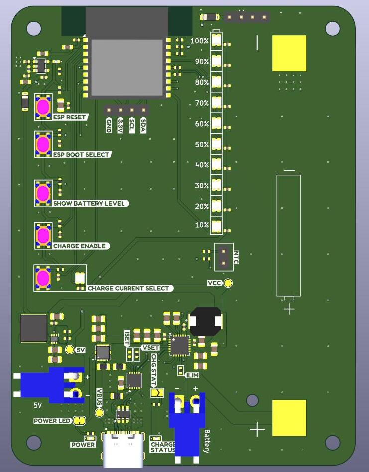

# USB-C PD Li-ion Charger

This project is a standalone Li ion Charger for singel cell 18650 batteries. 
It uses a switching regulator to be as efficient as possible. 
The board is powered by USB C Power Delivery. 

